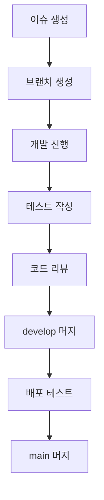

# 🔄 개발 워크플로우

## 📋 **개요**

Dataracy 백엔드 프로젝트의 개발 워크플로우와 협업 프로세스를 정의합니다.

---

## 🌿 **Git 브랜치 전략**

### **브랜치 구조**

```
main                    # 운영 브랜치
├── develop            # 개발 브랜치
├── feature/user-auth  # 기능 개발 브랜치
├── hotfix/critical-bug # 긴급 수정 브랜치
└── release/v1.2.0    # 릴리스 브랜치
```

### **브랜치 명명 규칙**

#### **기능 개발**

- `feature/{기능명}`
- `feature/user-authentication`
- `feature/project-search`

#### **버그 수정**

- `bugfix/{버그명}`
- `bugfix/login-error`
- `bugfix/file-upload-issue`

#### **긴급 수정**

- `hotfix/{수정내용}`
- `hotfix/security-patch`
- `hotfix/memory-leak`

#### **릴리스**

- `release/v{버전}`
- `release/v1.2.0`
- `release/v2.0.0`

---

## 🔄 **개발 프로세스**

### **1. 기능 개발**



#### **단계별 작업**

1. **이슈 생성**

   - GitHub Issues에서 이슈 생성
   - 라벨, 마일스톤, 담당자 지정
   - 상세한 설명과 요구사항 작성

2. **브랜치 생성**

   ```bash
   git checkout develop
   git pull origin develop
   git checkout -b feature/user-authentication
   ```

3. **개발 진행**

   - 기능 구현
   - 단위 테스트 작성
   - 통합 테스트 작성

4. **코드 리뷰**

   - Pull Request 생성
   - 코드 리뷰 요청
   - 피드백 반영

5. **머지 및 배포**
   - develop 브랜치 머지
   - 배포 테스트
   - main 브랜치 머지

---

## 📝 **Pull Request 가이드**

### **PR 템플릿**

```markdown
## 📋 변경 사항

- [ ] 새로운 기능 추가
- [ ] 버그 수정
- [ ] 성능 개선
- [ ] 리팩토링
- [ ] 문서 업데이트

## 🔍 변경 내용

<!-- 변경된 내용을 상세히 설명해주세요 -->

## 🧪 테스트

- [ ] 단위 테스트 추가/수정
- [ ] 통합 테스트 추가/수정
- [ ] 수동 테스트 완료

## 📸 스크린샷 (UI 변경 시)

<!-- UI 변경이 있는 경우 스크린샷을 첨부해주세요 -->

## ✅ 체크리스트

- [ ] 코드 스타일 가이드 준수
- [ ] 자체 코드 리뷰 완료
- [ ] 관련 문서 업데이트
- [ ] 테스트 커버리지 확인
```

### **리뷰 기준**

#### **코드 품질**

- [ ] 코드 스타일 준수
- [ ] 네이밍 컨벤션 준수
- [ ] 복잡도 적절성
- [ ] 예외 처리 적절성

#### **아키텍처**

- [ ] DDD 원칙 준수
- [ ] 계층 분리 적절성
- [ ] 의존성 방향 올바름
- [ ] 테스트 용이성

#### **성능**

- [ ] 쿼리 최적화
- [ ] 메모리 사용량
- [ ] 응답 시간
- [ ] 동시성 처리

---

## 🧪 **테스트 전략**

### **테스트 피라미드**

```
    🔺 E2E Tests (10%)
   🔺🔺 Integration Tests (20%)
  🔺🔺🔺 Unit Tests (70%)
```

### **테스트 실행**

#### **로컬 개발**

```bash
# 단위 테스트
./gradlew test

# 통합 테스트
./gradlew integrationTest

# 커버리지 확인
./gradlew jacocoTestReport
```

#### **CI/CD 파이프라인**

```yaml
- name: Run Tests
  run: |
    ./gradlew test
    ./gradlew jacocoTestReport
    ./gradlew jacocoTestCoverageVerification
```

---

## 🚀 **배포 프로세스**

### **환경별 배포**

#### **개발 환경**

- **브랜치**: `develop`
- **트리거**: PR 머지 시 자동 배포
- **목적**: 기능 검증 및 통합 테스트

#### **스테이징 환경**

- **브랜치**: `release/*`
- **트리거**: 수동 배포
- **목적**: 최종 검증 및 성능 테스트

#### **운영 환경**

- **브랜치**: `main`
- **트리거**: 승인 후 배포
- **목적**: 실제 서비스 제공

### **Blue-Green 배포**

```bash
# 배포 스크립트 실행
./deployment/scripts/deploy-dev.sh

# 상태 확인
./deployment/scripts/status.sh

# 트래픽 전환
cd deployment/dev/blue-green
./switch-dev.sh
```

---

## 📊 **모니터링 및 알림**

### **모니터링 지표**

#### **애플리케이션**

- **응답 시간**: 평균, 95퍼센타일
- **처리량**: 초당 요청 수
- **에러율**: 4xx, 5xx 에러 비율
- **가용성**: 서비스 가동률

#### **인프라**

- **CPU 사용률**: 평균, 최대
- **메모리 사용률**: 힙, 비힙
- **디스크 I/O**: 읽기/쓰기 속도
- **네트워크**: 대역폭 사용량

### **알림 설정**

#### **긴급 알림**

- **서비스 다운**: 즉시 알림
- **에러율 급증**: 5분 내 알림
- **응답 시간 지연**: 10분 내 알림

#### **일반 알림**

- **배포 완료**: 배포 성공 시
- **성능 저하**: 일일 리포트
- **용량 부족**: 주간 리포트

---

## 🔧 **개발 도구**

### **필수 도구**

#### **IDE**

- **IntelliJ IDEA**: 주요 개발 환경
- **VS Code**: 가벼운 편집용
- **플러그인**: Lombok, Checkstyle, SonarLint

#### **버전 관리**

- **Git**: 소스 코드 관리
- **GitHub**: 코드 저장소 및 협업
- **GitHub Actions**: CI/CD 파이프라인

#### **품질 관리**

- **SonarQube**: 코드 품질 분석
- **JaCoCo**: 테스트 커버리지
- **Checkstyle**: 코드 스타일 검사

### **협업 도구**

#### **커뮤니케이션**

- **Slack**: 팀 커뮤니케이션
- **이메일**: 공식 문서 및 알림
- **회의**: 정기 스탠드업, 회고

#### **문서화**

- **GitHub Wiki**: 프로젝트 문서
- **Notion**: 팀 지식 공유
- **Swagger**: API 문서

---

## 📅 **일정 관리**

### **스프린트 프로세스**

#### **스프린트 계획**

- **기간**: 2주
- **계획 회의**: 스프린트 시작 전
- **백로그**: 우선순위별 정리

#### **일일 스탠드업**

- **시간**: 오전 9시
- **내용**: 어제 작업, 오늘 계획, 이슈
- **소요 시간**: 15분

#### **스프린트 회고**

- **시간**: 스프린트 종료 후
- **내용**: 잘된 점, 개선점, 액션 아이템
- **소요 시간**: 1시간

### **이슈 관리**

#### **이슈 우선순위**

- **P0**: 긴급 (즉시 처리)
- **P1**: 높음 (당일 처리)
- **P2**: 보통 (주간 처리)
- **P3**: 낮음 (월간 처리)

#### **이슈 라벨**

- **bug**: 버그
- **feature**: 새로운 기능
- **enhancement**: 기능 개선
- **documentation**: 문서
- **refactoring**: 리팩토링

---

## 🎯 **성과 측정**

### **개발 지표**

#### **품질 지표**

- **테스트 커버리지**: 70% 이상
- **코드 품질**: A등급 유지
- **버그 발견률**: 배포 전 90% 이상

#### **생산성 지표**

- **스프린트 완료율**: 80% 이상
- **코드 리뷰 시간**: 평균 2시간 이내
- **배포 빈도**: 주 2회 이상

### **개선 활동**

#### **정기 회고**

- **주간**: 팀 회고
- **월간**: 프로세스 개선
- **분기**: 전략 검토

#### **학습 활동**

- **기술 공유**: 주간 기술 세미나
- **코드 리뷰**: 페어 프로그래밍
- **외부 학습**: 컨퍼런스, 온라인 강의

---

**💡 워크플로우 관련 문의사항은 개발팀에 연락해주세요!**
