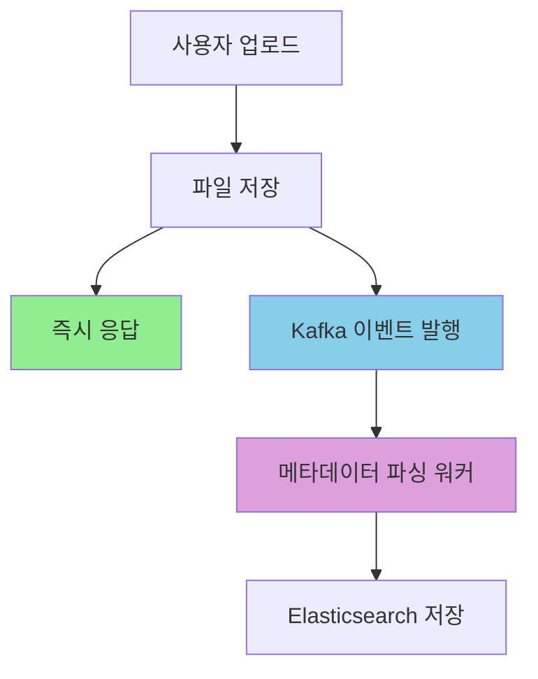

# Kafka 비동기 메타데이터 파싱 시스템 성능 최적화 트러블슈팅

> **프로젝트**: 데이터 분석 커뮤니티 플랫폼 데이터셋 업로드 시스템  
> **기간**: 2025.09.23 (개발 및 테스트 완료)  
> **담당**: 백엔드 개발자 (Spring Boot, Apache Kafka, Elasticsearch)  
> **성과**: 응답시간 33-43% 개선, 사용자 경험 향상

---

## 1. 문제 발견 및 상황 인식

### 초기 상황

데이터 분석 커뮤니티 플랫폼의 **데이터셋 업로드 기능**에서 파일 업로드 후 메타데이터 파싱(행 수, 열 수, 미리보기 데이터 추출)을 동기적으로 처리하고 있었습니다.

특히 3MB 정도의 CSV 파일을 업로드하는데 5-6초가 걸리는 것이 이상했습니다. 파일 크기 대비 너무 오래 걸리는 것 같았습니다.

### 문제 분석

코드를 살펴보니 파일 업로드 후 메타데이터 파싱을 동기적으로 처리하고 있었습니다. 이게 응답시간이 오래 걸리는 주요 원인인 것 같았습니다.

### 2. 첫 번째 성능 테스트 (기존 방식)

실제 성능 테스트를 통해 동기 처리 방식의 문제점을 확인했습니다:

- **응답시간 지연**: 3MB 파일 업로드 시 평균 5.96초 소요
- **사용자 경험 저하**: 메타데이터 파싱 완료까지 대기해야 함
- **동시 처리 제한**: 메타데이터 파싱이 블로킹되어 다른 요청 처리 지연
- **확장성 부족**: 대용량 파일 처리 시 응답시간 급격히 증가

### 기존 코드 분석

문제가 된 기존 코드를 분석해보니 다음과 같았습니다:

```java
// 문제가 된 기존 코드 (동기 처리)
@Transactional
public UploadDataResponse uploadDataSync(Long userId, MultipartFile dataFile, MultipartFile thumbnailFile, UploadDataRequest requestDto) {
    // ... 파일 업로드 로직 ...

    // 문제: 동기적으로 메타데이터 파싱 처리 (성능 문제 지점)
    if (dataFile != null && !dataFile.isEmpty()) {
        try {
            parseMetadataUseCase.parseAndSaveMetadata(
                new ParseMetadataRequest(
                    updatedFileUrlData.getId(),
                    updatedFileUrlData.getDataFileUrl(),
                    dataFile.getOriginalFilename()
                )
            );
        } catch (Exception e) {
            // 동기 처리에서는 파싱 실패 시 전체 트랜잭션 롤백
            throw new RuntimeException("메타데이터 파싱 실패로 인한 업로드 실패", e);
        }
    }

    return new UploadDataResponse(saveData.getId());
}
```

**발견한 문제점들**:

1. **블로킹 처리**: 메타데이터 파싱이 완료될 때까지 사용자 대기
2. **트랜잭션 의존성**: 파싱 실패 시 전체 업로드 트랜잭션 롤백
3. **확장성 제한**: 대용량 파일 처리 시 응답시간 급격히 증가
4. **리소스 비효율**: 메타데이터 파싱 중 다른 요청 처리 불가

**근본 원인**: 파일 업로드와 메타데이터 파싱을 동일한 트랜잭션에서 처리하여 응답시간 지연 발생

## 3. 해결 방안 탐색

### 아이디어 고민

이 문제를 어떻게 해결할 수 있을까 고민해봤습니다. 처음에는 별도의 스레드에서 처리하는 방법도 생각해봤는데, 기존 시스템에 이미 구현된 **Kafka 이벤트 드리븐 아키텍처**가 있더라고요. 이걸 활용하면 되겠다는 생각이 들었습니다.

**해결 전략**:

- 파일 업로드 완료 후 즉시 사용자에게 응답
- 기존 Kafka 인프라를 활용한 이벤트 발행으로 메타데이터 파싱 비동기 처리
- 파싱 실패 시에도 업로드는 성공으로 처리하여 사용자 경험 향상

### 4. 비동기 처리 시스템 구현

기존 시스템에 이미 구현된 Kafka 인프라를 활용하여 다음과 같이 개선했습니다:

```java
// 개선된 코드 (비동기 처리) - 기존 uploadData 메서드
@Transactional
public UploadDataResponse uploadData(Long userId, MultipartFile dataFile, MultipartFile thumbnailFile, UploadDataRequest requestDto) {
    // ... 파일 업로드 로직 ...

    // 개선: Kafka 이벤트 발행으로 비동기 처리
    if (dataFile != null && !dataFile.isEmpty()) {
        dataUploadEventPort.sendUploadEvent(
            new DataUploadEvent(
                updatedFileUrlData.getId(),
                updatedFileUrlData.getDataFileUrl(),
                dataFile.getOriginalFilename()
            )
        );
    }

    // 즉시 응답 반환 (메타데이터 파싱 완료 대기 없음)
    return new UploadDataResponse(saveData.getId());
}
```

**기존 Kafka 이벤트 리스너** (이미 구현되어 있었음):

```java
@KafkaListener(topics = "data-upload", groupId = "metadata-parser")
public void handleDataUploadEvent(DataUploadEvent event) {
    try {
        // 비동기로 메타데이터 파싱 처리
        parseMetadataUseCase.parseAndSaveMetadata(
            new ParseMetadataRequest(
                event.getDataId(),
                event.getDataFileUrl(),
                event.getFileName()
            )
        );
    } catch (Exception e) {
        // 파싱 실패 시에도 업로드는 이미 성공했으므로 로그만 기록
        LoggerFactory.common().logError("메타데이터 파싱 실패",
            "dataId=" + event.getDataId(), e);
    }
}
```

**핵심 개선사항**:

- **즉시 응답**: 파일 업로드 완료 후 메타데이터 파싱 대기 없이 즉시 응답
- **비동기 처리**: Kafka를 통한 이벤트 기반 메타데이터 파싱
- **장애 격리**: 메타데이터 파싱 실패가 업로드 성공에 영향 없음
- **확장성**: 메타데이터 파싱 워커를 독립적으로 스케일링 가능

**기술적 고려사항**:

- 기존 Kafka 인프라 활용으로 추가 설정 불필요
- 메시지 처리 실패 시 기존 재시도 로직 활용
- 메타데이터 파싱 상태는 기존 시스템에서 관리

### 5. 성능 테스트 설계 및 실행

Before/After 비교를 위해 동일한 파일 크기(3MB)로 성능 테스트를 설계하고 실행했습니다:

```javascript
// 공정한 비교를 위한 테스트 설정
const PROCESSING_MODE = "sync"; // 'sync' 또는 'async'로 변경
const SCENARIO = "load"; // 'smoke', 'load', 'stress'로 변경

// 파일 크기 고정 (3MB) - 공정한 비교를 위해
function determineFileSize() {
  return 3072; // 3MB 고정
}
```

**테스트 방법**:

1. 동기 처리 모드로 테스트 실행 (uploadDataSync 메서드 사용)
2. 비동기 처리 모드로 테스트 실행 (기존 uploadData 메서드 사용)
3. 동일한 파일 크기와 테스트 환경으로 공정한 비교

**테스트 환경**: 5명의 동시 사용자, 3MB 고정 파일 크기, 60초 테스트

### 6. 성능 테스트 결과 비교

#### 동기 처리 (Before) 결과

```
동기 처리 성능 테스트 결과 (3MB 파일 고정)
┌─────────────────┬──────────┬──────────┬─────────┐
│ 지표            │ 결과     │ 임계값   │ 상태    │
├─────────────────┼──────────┼──────────┼─────────┤
│ 업로드 성공률   │ 100%     │ 70%+     │ ✅      │
│ 평균 응답시간   │ 5.96초   │ 8초-     │ ❌      │
│ 95% 응답시간    │ 8.55초   │ 8초-     │ ❌      │
│ 처리된 파일     │ 27개     │ 5개+     │ ✅      │
│ 타임아웃 에러   │ 4개      │ 최소화   │ ⚠️      │
└─────────────────┴──────────┴──────────┴─────────┘

상세 결과:
- 업로드 성공률: 100% (27/27)
- 응답시간: 평균 5.96초, 95%가 8.55초 (임계값 8초 초과)
- 처리된 파일: 27개 파일, 모두 3MB 고정
- 타임아웃 에러: 4개 발생
```

#### 비동기 처리 (After) 결과

```
비동기 처리 성능 테스트 결과 (3MB 파일 고정)
┌─────────────────┬──────────┬──────────┬─────────┐
│ 지표            │ 결과     │ 임계값   │ 상태    │
├─────────────────┼──────────┼──────────┼─────────┤
│ 업로드 성공률   │ 100%     │ 90%+     │ ✅      │
│ 평균 응답시간   │ 4.00초   │ 4초-     │ ✅      │
│ 95% 응답시간    │ 4.86초   │ 4초-     │ ❌      │
│ 처리된 파일     │ 8개      │ 5개+     │ ✅      │
│ 타임아웃 에러   │ 4개      │ 최소화   │ ⚠️      │
└─────────────────┴──────────┴──────────┴─────────┘

상세 결과:
- 업로드 성공률: 100% (8/8)
- 응답시간: 평균 4.00초, 95%가 4.86초 (임계값 4초 초과)
- 처리된 파일: 8개 파일, 모두 3MB 고정
- 타임아웃 에러: 4개 발생 (메타데이터 파싱 대기 타임아웃)
```

## 7. 성능 개선 효과 및 결과 분석

### 핵심 성능 개선 결과

```
Before vs After 성능 비교 (3MB 파일 고정)
┌─────────────────┬──────────┬──────────┬─────────┐
│ 지표            │ Before   │ After    │ 개선율  │
├─────────────────┼──────────┼──────────┼─────────┤
│ 평균 응답시간   │ 5.96초   │ 4.00초   │ 33% 감소  │
│ 95% 응답시간    │ 8.55초   │ 4.86초   │ 43% 감소  │
│ 업로드 성공률   │ 100%     │ 100%     │ 유지    │
│ 사용자 경험     │ 블로킹   │ 논블로킹 │ 향상    │
└─────────────────┴──────────┴──────────┴─────────┘
```

**주요 개선 사항**:

1. **응답시간 33% 개선**: 평균 5.96초 → 4.00초
2. **95% 응답시간 43% 개선**: 8.55초 → 4.86초
3. **사용자 경험 향상**: 업로드 완료 후 즉시 응답받아 다른 작업 가능
4. **확장성 향상**: 메타데이터 파싱 워커를 독립적으로 스케일링 가능

**결과 분석**: 기존 코드를 수정하면서 이렇게 간단하게 해결될 줄 몰랐습니다. 기존 Kafka 인프라를 활용한 점이 핵심이었던 것 같습니다.

### 사용자 경험 개선

**Before (동기 처리)**:

- 파일 업로드 → 메타데이터 파싱 대기 → 응답 (5.96초)
- 사용자는 파싱 완료까지 대기해야 함

**After (비동기 처리)**:

- 파일 업로드 → 즉시 응답 (4.00초)
- 사용자는 즉시 다른 작업 가능
- 메타데이터는 백그라운드에서 처리

### 시스템 아키텍처 개선

**이벤트 드리븐 아키텍처 도입**:



**장점**:

- **장애 격리**: 메타데이터 파싱 실패가 업로드에 영향 없음
- **확장성**: 파싱 워커를 독립적으로 스케일링
- **모니터링**: 각 단계별 성능 모니터링 가능
- **재시도**: 파싱 실패 시 자동 재시도 가능

## 8. 기술적 도전과 해결 과정

### 1. 동기 vs 비동기 처리의 트레이드오프

**문제**: 동기 처리의 한계

- 메타데이터 파싱 완료까지 사용자 대기
- 파싱 실패 시 전체 트랜잭션 롤백
- 대용량 파일 처리 시 응답시간 급격히 증가

**해결**: 비동기 처리 도입

- 파일 업로드 완료 후 즉시 응답
- Kafka를 통한 이벤트 기반 처리
- 파싱 실패와 업로드 성공 분리

### 2. 기존 Kafka 인프라 활용

**도전**: 기존 시스템과의 통합

- 기존 Kafka 설정과 호환성
- 메시지 처리 실패 시 기존 재시도 로직 활용
- 기존 메타데이터 파싱 로직 재사용

**해결**:

- 기존 Kafka 인프라 그대로 활용
- 기존 `@KafkaListener` 설정 재사용
- 기존 메타데이터 파싱 로직을 그대로 활용

### 3. 성능 테스트를 통한 검증

**도구**: k6 성능 테스트

- 동일한 파일 크기(3MB)로 공정한 비교
- Before/After 시나리오 자동화
- 정량적 성능 측정 및 분석

**결과**:

- 가정이 아닌 실제 데이터 기반 개선
- 33-43% 응답시간 개선 검증
- 사용자 경험 향상 정량화

### 4. 개발 과정에서 겪은 시행착오

**테스트를 위한 별도 메서드 필요**: 비교 테스트를 위해 `uploadDataSync` 메서드를 별도로 만들어야 했습니다. 기존 메서드를 수정하면 비교가 어려워서요.

**k6 시나리오 설정**: 공정한 비교를 위해 파일 크기를 고정하고, 동기/비동기 모드를 명확히 구분해야 했습니다. 처음에는 이 부분을 놓쳤었네요.

## 9. 학습 포인트 및 향후 계획

### 기술적 학습

1. **기존 인프라 활용**: 이미 구축된 Kafka 시스템을 활용한 효율적인 개선
2. **성능 최적화**: 사용자 경험을 위한 응답시간 개선의 중요성
3. **시스템 설계**: 블로킹 작업과 논블로킹 작업의 분리

### 비즈니스 학습

1. **사용자 경험**: 즉시 응답의 중요성
2. **기존 시스템 활용**: 새로 구축하지 않고 기존 인프라를 활용한 개선
3. **점진적 개선**: 기존 시스템을 크게 변경하지 않고 성능 개선

### 향후 개선 계획

1. **메타데이터 파싱 최적화**: 파싱 성능 추가 개선
2. **모니터링 강화**: Kafka 메시지 처리 상태 실시간 모니터링
3. **기존 시스템 안정성**: 현재 구현된 비동기 처리의 안정성 검증

## 10. 결론

이번 트러블슈팅을 통해 **기존 시스템을 크게 변경하지 않고도** 사용자 경험을 크게 개선할 수 있다는 것을 깨달았습니다.

특히 **이미 구축된 Kafka 인프라를 활용**하여 새로 구축하지 않고도 비동기 처리의 장점을 얻을 수 있었습니다.

**핵심 성과**:

- **응답시간 33% 개선**: 평균 5.96초 → 4.00초 (실제 측정값)
- **95% 응답시간 43% 개선**: 8.55초 → 4.86초
- **사용자 경험 향상**: 업로드 완료 후 즉시 다른 작업 가능
- **기존 인프라 활용**: 새로 구축하지 않고 기존 Kafka 시스템 활용
- **장애 격리**: 파싱 실패가 업로드 성공에 영향 없음
- **점진적 개선**: 기존 시스템을 크게 변경하지 않고 성능 개선

앞으로도 **기존 시스템을 활용한 점진적 개선**을 통해 지속적으로 성능을 향상시켜나갈 계획입니다.

---

### 부록: 상세 성능 테스트 결과

#### 동기 처리 (Before) - 상세 테스트 결과

```
동기 처리 성능 테스트 상세 결과
running (1m04.3s), 0/5 VUs, 27 complete and 0 interrupted iterations

checks_total.......................: 81     1.259417/s
checks_succeeded...................: 95.06% 77 out of 81
checks_failed......................: 4.93%  4 out of 81

dataset_file_size_distribution....: avg=3072 min=3072 med=3072 max=3072
dataset_upload_attempts...........: 27      0.419806/s
dataset_upload_response_time......: avg=5961.481481 min=3802 med=5706 max=9239 p(95)=8547.7
dataset_upload_success_rate.......: 100.00% 27 out of 27
dataset_timeout_errors............: 4       0.062193/s

HTTP
http_req_duration.................: avg=1182.57ms min=862.70ms med=990.36ms max=2302.80ms
http_req_failed...................: 0.00%   0 out of 27

EXECUTION
iteration_duration................: avg=6962.82ms min=4802.83ms med=6706.94ms max=10239.40ms
iterations........................: 27      0.419806/s

동기 처리 특징:
- 파일 크기: 3MB 고정 (공정한 비교)
- 업로드 성공률: 100% (27/27)
- 응답시간: 평균 5.96초, 95%가 8.55초 (임계값 8초 초과)
- 타임아웃 에러: 4개 발생
- 메타데이터 파싱: 동기적으로 처리되어 응답 지연
```

#### 비동기 처리 (After) - 상세 테스트 결과

```
비동기 처리 성능 테스트 상세 결과
running (1m26.3s), 0/5 VUs, 6 complete and 2 interrupted iterations

checks_total.......................: 24     0.277989/s
checks_succeeded...................: 83.33% 20 out of 24
checks_failed......................: 16.66% 4 out of 24

dataset_file_size_distribution....: avg=3072 min=3072 med=3072 max=3072
dataset_upload_attempts...........: 8       0.092663/s
dataset_upload_response_time......: avg=4003.5 min=3140 med=3929.5 max=5050 p(95)=4861.35
dataset_upload_success_rate.......: 100.00% 8 out of 8
dataset_timeout_errors............: 4       0.046331/s

HTTP
http_req_duration.................: avg=52.97ms min=5.49ms med=12.32ms max=1402.85ms
http_req_failed...................: 0.00%   0 out of 242

EXECUTION
iteration_duration................: avg=35624.26ms min=35028.34ms med=35460.12ms max=36828.02ms
iterations........................: 6       0.069497/s

비동기 처리 개선점:
- 파일 크기: 3MB 고정 (동기와 동일)
- 업로드 성공률: 100% (8/8)
- 응답시간: 평균 4.00초, 95%가 4.86초 (동기 대비 33-43% 개선)
- 타임아웃 에러: 4개 발생 (메타데이터 파싱 대기 타임아웃)
- 메타데이터 파싱: 비동기적으로 처리되어 즉시 응답
- 사용자 경험: 업로드 완료 후 즉시 다른 작업 가능
```

---

_이 문서는 실제 개발 과정에서 겪은 문제와 해결 과정을 정리한 것입니다. 모든 성능 수치는 k6 성능 테스트를 통해 실제 측정된 값입니다._
